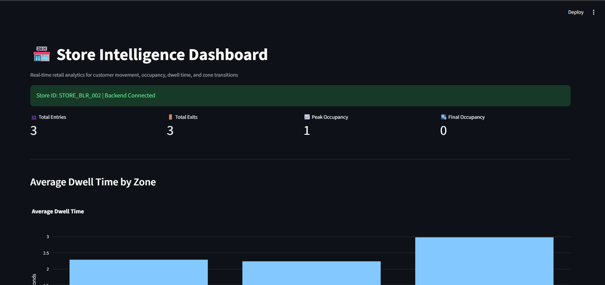
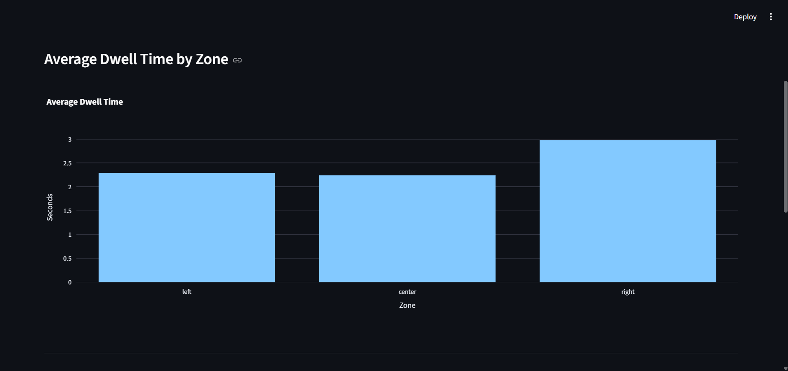
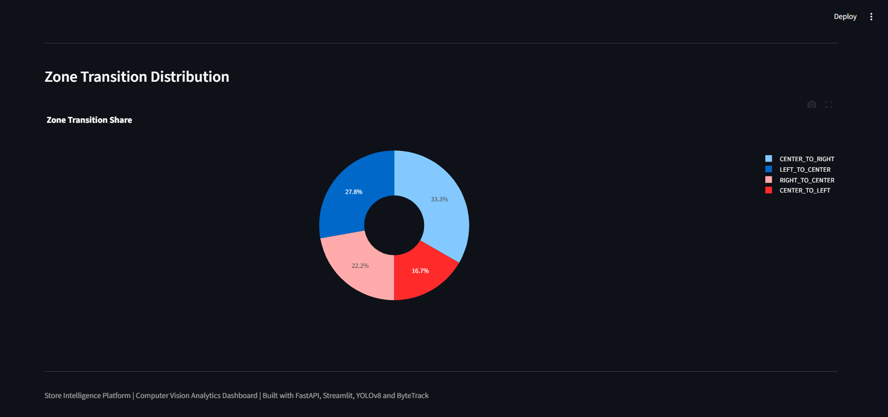

# 🏪 Store Intelligence Platform

A computer vision powered retail analytics system that tracks customer movement, occupancy, dwell time, and zone transitions using multi-camera video streams.

---

## Overview

Store Intelligence Platform analyzes in-store customer behavior from surveillance footage and generates actionable retail insights.

The system processes video feeds from multiple cameras, detects and tracks customers, generates customer events, computes analytics, exposes metrics through FastAPI APIs, and visualizes insights in a Streamlit dashboard.

---

## Features

### Customer Analytics

- Customer Entry Detection
- Customer Exit Detection
- Footfall Counting
- Occupancy Tracking
- Peak Occupancy Analysis

### Behavioral Analytics

- Zone-wise Dwell Time
- Customer Journey Analysis
- Zone Transition Tracking

### Dashboard Analytics

- KPI Metrics
- Dwell Time Visualization
- Zone Transition Distribution
- Live API Integration

---

## Technology Stack

### Computer Vision

- YOLOv8
- OpenCV

### Tracking

- ByteTrack

### Backend

- FastAPI

### Frontend

- Streamlit
- Plotly

### Data Processing

- Python
- Pandas

## Installation and Setup

### Clone Repository

```bash
git clone https://github.com/gurugubelliharish/store-intelligence.git
cd store-intelligence
```

### Create Virtual Environment

```bash
python -m venv venv
venv\Scripts\activate
```

### Install Dependencies

```bash
pip install -r requirements.txt
```

### Run FastAPI Backend

```bash
uvicorn backend.api.main:app --reload
```

Backend URL:

```
http://127.0.0.1:8000
```

### Run Streamlit Dashboard

```bash
streamlit run dashboard/app.py
```

Dashboard URL:

```
http://localhost:8501
```

### Run Detection Pipeline

```bash
python backend/run_pipeline.py
```


---

## Project Architecture

```text
Video Streams
      │
      ▼
YOLOv8 Detection
      │
      ▼
ByteTrack Tracking
      │
      ▼
Event Generation
      │
      ▼
Analytics Engine
      │
      ▼
Store Metrics JSON
      │
      ▼
FastAPI Backend
      │
      ▼
Streamlit Dashboard
```

## Key Metrics Generated

- Total Entries
- Total Exits
- Peak Occupancy
- Final Occupancy
- Average Dwell Time by Zone
- Zone Transition Counts

## Dashboard Preview

### Store Intelligence Dashboard



### Dwell Time Analytics



### Zone Transition Analytics



## Future Enhancements

- Real-time Streaming Analytics
- Heatmap Generation
- Store Layout Visualization
- Occupancy Trend Analysis
- POS Sales Correlation
- Conversion Funnel Analytics

## Author

Gurugubelli Harish 
gurugubelliharish090104@gmail.com